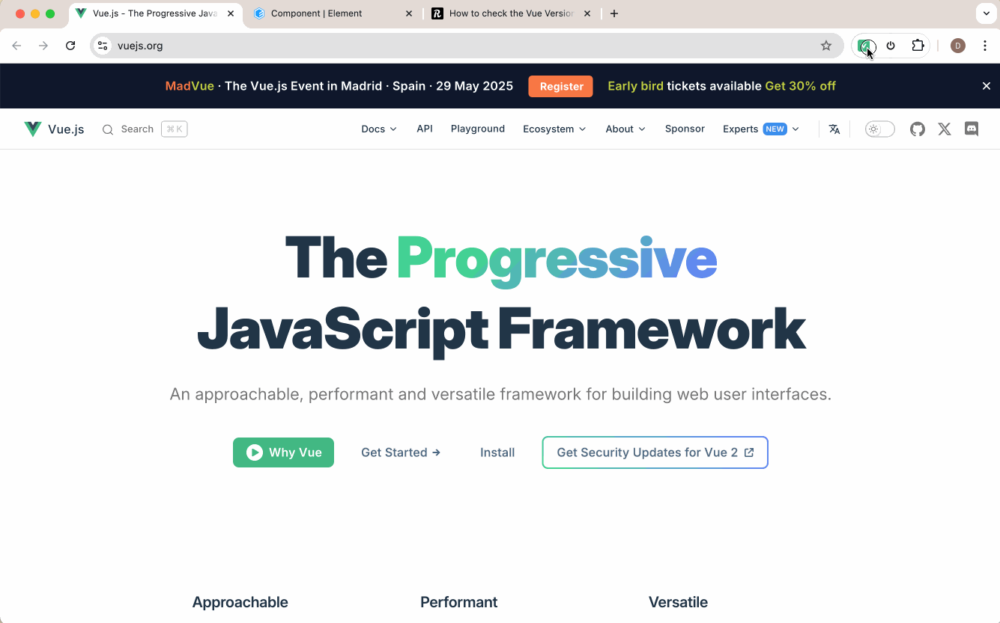

# open-vue-devtools

For vue projects that have been deployed online, if you need to use Vue DevTools, you can use this extension.

Note: You must have the Vue DevTools extension installed first and enabled.

## install

1. Download the code
2. Open Chrome DevTools and click the extension icon in the toolbar
3. Click the "Load unpacked" button
4. Select the folder where the code is located

## Usage

1. Open the popup by clicking the extension icon in the Chrome toolbar.
2. Click the "Enable" button.
3. The Vue DevTools will be enabled for the current tab.

If the steps above don't work, please try:

1. Close Chrome DevTools
2. Reopen the open-vue-devtools extension and click the Enable button
3. Reopen Chrome DevTools

